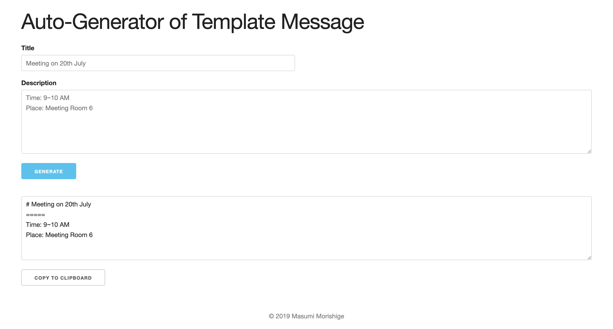

# Auto-Generator of Template Message
=====
## Description
An application that generates a template message.

## Demo

Link: https://template-message-generator.herokuapp.com/

## Dependency / Requirements
### Python
- `v3.7.3`

### Library
```
Click==7.0
Flask==1.1.1
itsdangerous==1.1.0
Jinja2==2.10.3
MarkupSafe==1.1.1
Werkzeug==0.16.0
```

## Setup / Usage
Setup: `pip install -r ./requirements.txt`<br>
Usage: `python3 server.py`<br>
localhost: `http://127.0.0.1:8080/` or `http://localhost:8080/`<br>

## Program Flow
### 1. Creating Scaffold

### 2. Create the Input
- Title
- Description

### 3. Create the Output

### 4. Fix Design
- using [Skeleton](http://getskeleton.com) 

## Author
- [Masumi Morishige](https://github.com/Masumi-M)

## References
- [Skeleton](http://getskeleton.com)

## Prospects
- [ ] saves automatically to the clipboard
- [ ] exchanges async
- [ ] responsive design
- [ ] more options for templates such as READEME.md
